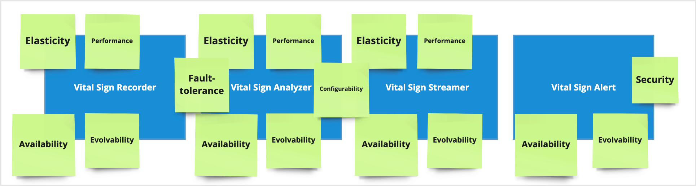

# Architecture characteristics

## Requirements Distillation
To effectively select the appropriate architecture characteristics, it is essential to begin with the requirements and meticulously identify keywords, aligning them with the pertinent definitions of architecture characteristics.

| Term            | Definition                                                                                                                                                                                                                                                                                                                                     |
|-----------------|------------------------------------------------------------------------------------------------------------------------------------------------------------------------------------------------------------------------------------------------------------------------------------------------------------------------------------------------|
| Availability    | Availability refers to the reliability and operational readiness of a building or space, ensuring it remains accessible and fully functional for its intended purpose, thus meeting the needs of occupants without significant interruptions or downtime, ultimately contributing to a seamless user experience.                               |
| Evolvability    | Evolvability pertains to the adaptability and resilience of a building or space, facilitating its capacity to accommodate future changes in requirements, environments, or functions, thereby ensuring its continued relevance and effectiveness over time.                                                                                    |
| Elasticity      | Elasticity refers to the dynamic adaptability of a building or space to fluctuating demands, allowing for flexible allocation of resources and scalable adjustments to meet changing needs, ensuring optimal performance and user satisfaction.                                                                                                |
| Security        | Security encompasses the strategies, practices, and technologies designed to protect data and systems from unauthorized access, breaches, attacks, and other cyber threats. It involves ensuring data confidentiality, integrity, and availability, protecting against vulnerabilities, and complying with relevant regulations and standards. |
| Deployability   | Deployability is the ease with which a software system can be deployed, updated, or migrated to different environments. It includes considerations for packaging, configuration, and installation processes. Systems with high deployability support rapid releases, easier updates, and minimal downtime.                                     |
| Fault-tolerance | Fault-tolerance describes a building or space's ability to endure and recover from potential failures or disruptions, integrating redundant systems and resilient design elements to sustain functionality and safety, thereby guaranteeing uninterrupted operations and mitigating risks for occupants.                                       |
| Performance     | Performance refers to a system's responsiveness, speed, and stability under a given load. It measures how quickly a system can process transactions, execute tasks, and deliver information to users. High performance contributes to a better user experience and efficiency in operations.                                                   |
| Configurability | Configurability refers to the adaptiveness and versatility of a building or space to be easily reconfigured or customized according to changing needs or preferences, facilitating efficient utilization of space and enhancing user satisfaction by accommodating diverse requirements.                                                       |
| Scalability   | Scalability refers to a system's ability to handle increased loads without compromising performance or user experience. This can involve scaling up (adding more resources to the existing infrastructure) or scaling out (adding more instances of resources). Scalability ensures that the system can grow in response to increased demand, whether it's handling more data, users, or transactions. |

# Choosing the Top 7 characteristics
The primary considerations that should be prioritized are as follows:
* *Performance*, given the stringent demands from the business.
* *Security*, particularly crucial in a hospital setting where the system manages highly sensitive data.
* *Availability*, as the system directly impacts human lives and must be continuously monitored.
* *Evolvability*, allowing for the seamless integration of new sensors and devices.
* *Elasticity*, as additional sensors may necessitate additional nodes or hardware.
* *Fault-tolerance*, ensuring system functionality even in scenarios where certain sensors may be non-operational.
* *Configurability*, because the alert's rules should be configurable.

The importance of *Scalability* has been downplayed as the maximum load has already been defined. In the event of adding new sensors, the system can be manually rescaled by incorporating additional nodes or hardware.
Regarding *Deployability*, its significance is diminished as the system will be installed only once per hospital, without the need for migrations.

# Finding top3 architecture characteristics
On the Event storming session, there were discovered 4 logic modules of *MonitorMe* application:

The subsequent step involves tagging identified components, placing sticky notes where the characteristic is necessary. 

As shown in the picture above, certain characteristics are significant only for individual modules, such as *Security*, *Fault-tolerance*, and *Configurability*. 
Among the remaining four characteristics:
* *Availability*
* *Evolvability*
* *Performance*
* *Elasticity*

it is challenging to narrow down to only three characteristics, but it is important to note that *Availability* is contingent upon both *Performance* and *Elasticity*. 
If both are satisfactory, the system should remain available. Consequently, the final Top 3 are *Evolvability*, *Performance*, and *Elasticity*.

