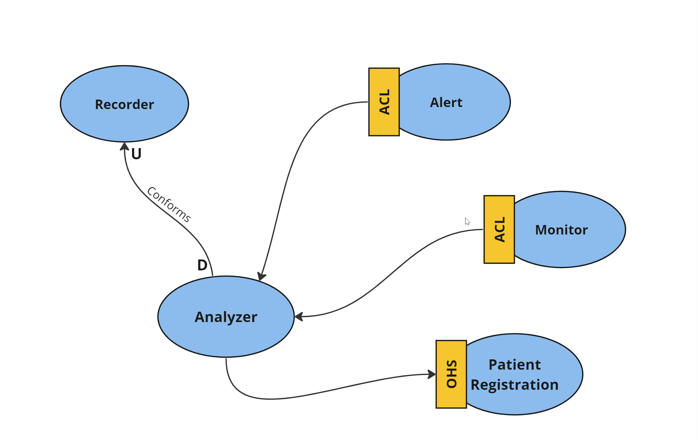

# Team topology

Team Topologies represents a modern method for designing organizational structures and team setups with the goal of enhancing software delivery and organizational efficiency. It presents a set of guidelines and models for shaping teams according to the requirements of the software architecture and the organization's objectives. By aligning team structures with the system architecture, Team Topologies encourages improved communication, cooperation, and independence among teams, leading to quicker delivery of top-notch software. This approach underscores the significance of establishing clear boundaries, roles, and duties within teams, while also fostering a culture of learning and ongoing enhancement. Ultimately, Team Topologies provides a framework for constructing adaptable, robust organizations capable of excelling in today's intricate and ever-changing software development environment.

## We have created a Context Map using Domain-Driven Design (DDD) principles.

### Purpose of Context Mapping:

Context Mapping is a technique used in Domain-Driven Design (DDD) to visually represent the relationships and boundaries between different bounded contexts within a software system. It helps stakeholders understand how different parts of the system interact and communicate with each other, clarifying the context boundaries and responsibilities of each domain. By creating a Context Map, we aim to:

1. **Clarify Boundaries**: Define clear boundaries between bounded contexts to prevent ambiguity and ensure proper separation of concerns.
   
2. **Identify Interactions**: Identify the interactions and dependencies between different bounded contexts, facilitating communication and collaboration among development teams.
   
3. **Resolve Ambiguities**: Resolve ambiguities and conflicts that may arise due to overlapping responsibilities or conflicting domain models between bounded contexts.
   
4. **Support Strategic Design**: Support strategic design decisions by visualizing the overall architecture and context dependencies, enabling better alignment with business goals and domain-driven design principles.

Eventually we prepared this map:

Based on the map, it was observed that the context related to patient data analysis and recording can collaborate on a conformist basis. Sequentially, the monitoring/streaming context and the alarm context should have an applied anti-corruption layer. This layer facilitates the translation of communications between the two systems, enabling one system to remain unchanged while the other can adapt without compromising its design and technological approach. Additionally, a separate context responsible for patient data registration and their monitoring devices was identified.

Based on the Team Topologies and the structure of MonitorMe we designed a team composition that consists of two stream-aligned teams and one platform team. Here's how the teams can be structured:

## Stream-Aligned Teams

## - Team A - Vital Sign Monitoring Team

### Responsibilities:
- Develops and maintains components related to vital sign recording, streaming, and real-time monitoring.
- Implements features for collecting and analyzing patient vital sign data.

### Skills and Expertise:
- Software engineers with expertise in real-time data processing, streaming technologies, and data analysis.
- Domain knowledge in healthcare and medical monitoring systems.

## - Team B - Alerting and Notification Team

### Responsibilities:
- Develops and maintains components responsible for generating and delivering alerts to nurse stations and mobile devices.
- Implements features for detecting anomalies in vital sign data and triggering alerts.
- Implements and maintains features responsible for patient registration process and ensures accurate recording of patient information. 

### Skills and Expertise:
- Software engineers with expertise in event-driven architectures, notification systems, and alerting mechanisms.
- Proficiency in designing fault-tolerant and scalable systems.

## - Platform Team

### Responsibilities:
- Develops and maintains the core platform components shared across the system.
- Provides infrastructure, tooling, and support services for stream-aligned teams.
- Ensures architectural integrity, scalability, and reliability of the overall system.

### Skills and Expertise:
- Software architects with expertise in building distributed systems, microservices architecture, and cloud-native technologies.
- DevOps engineers proficient in automation, deployment, and monitoring of cloud infrastructure.

## Assumptions we made:
- Follow the principles of Conway's Law, ensuring that team structures reflect the system's architecture
- Teams are cross-functional, comprising members with diverse skills necessary for end-to-end delivery of features.
- Team autonomy is encouraged, allowing teams to make decisions independently within their respective domains while aligning with overall system goals.