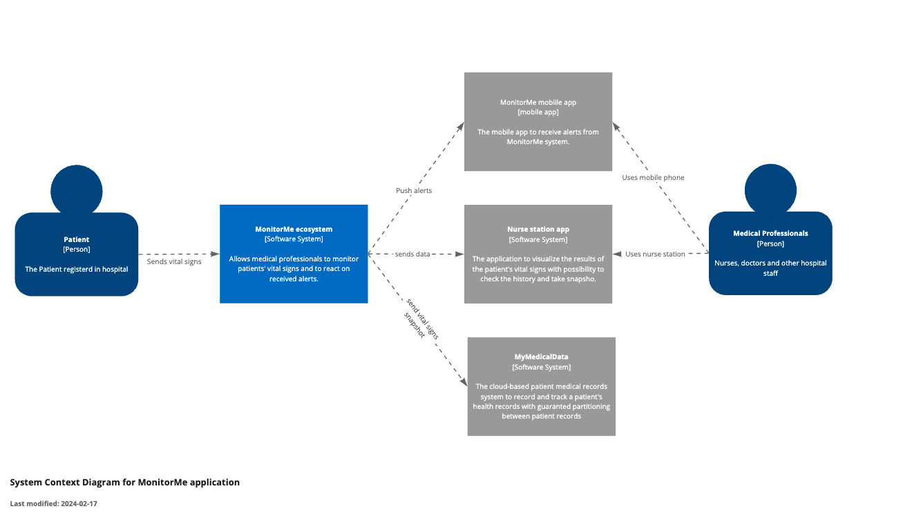

# Context view (C1)

In the Context view (C1) of the Monitor Me system, the main components include:

* *Patient (Actor)*  - Represents the individual whose vital signs are being monitored by the system. The patient's vital sign data is collected and analyzed by Monitor Me to ensure timely intervention and care.
* *Medical Professionals (Actor)* - Encompasses the nurses and doctors responsible for monitoring and caring for patients within the healthcare facility. Utilize both the nurse station interface and the mobile app to access patient vital sign data and respond to alerts promptly.  These main components interact within the Monitor Me system to ensure effective monitoring, analysis, and response to patient vital signs, ultimately contributing to improved patient outcomes and healthcare delivery.
* *MonitorMe Ecosystem (application)* - Refers to the core Monitor Me system, which encompasses the software, hardware, and infrastructure required for vital sign monitoring and analysis. Responsible for collecting, storing, analyzing, and presenting patient vital sign data.
* *Mobile App (application)* - Represents the StayHealthy Mobile App used by medical professionals to receive push notifications and access vital sign data remotely. Enables medical professionals to stay updated on patient status and respond promptly to alerts, even when away from the nurse station.
* *Nurse Station (application)* - Represents the central hub where vital sign data is consolidated and displayed for medical professionals. Provides real-time monitoring of patient vital signs and alerts medical staff to any abnormalities or critical events.
