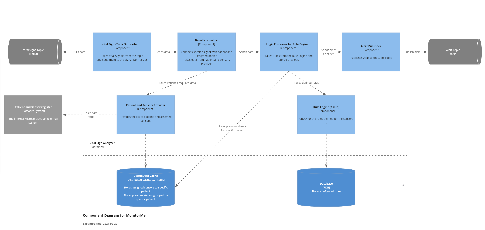

# Component view (C3)
In the C4 model, C3 represents the Component view, which focuses on the internal components and their interactions within a single container or application. This view provides a detailed breakdown of the software architecture, including the different types of containers (e.g., services, databases, user interfaces) and their relationships. 

## C3 for Vital Sign Analyzer
In our specific case, the most crucial and complex component is the Vital Sign Analyzer. The team has decided to thoroughly visualize this component using the C3 level.

### The internal flow
* *The Vital Signs Topic Subscriber* receives each signal from the *Vital Signs Topic* and forwards it to the *Signal Normalizer*.
* *The Signal Normalizer* matches the received signal with the corresponding patient (and assigned doctor). Subsequently, the data is sent to the *Logic Processor for Rule Engine*.
* *The Logic Processor for Rule Engine* evaluates each signal to determine:
  * If any anomalies are present within the current signal.
  * Whether cached data from different sensors (grouped by patient) analyzed by predefined rules detects anomalies.
  * If anomalies are detected, a message is sent to the Alert Publisher.
* *The Alert Publisher* publishes the message to the *Alert Topic* on Kafka.

### Supportive domains
* *Patient and Sensor Provider* takes data from Patient and Sensor register and stores them internally inside Distributed Cache.
* *Rule Engine (CRUD)* stores defined and configured rules for sensors' set.

### Decisions
* The Distributed Cache is used to ensure that crucial data is not lost even if the Vital Sign Analyzer crashes.
* The Distributed Cache can be utilized across multiple instances of the Vital Sign Analyzer.
