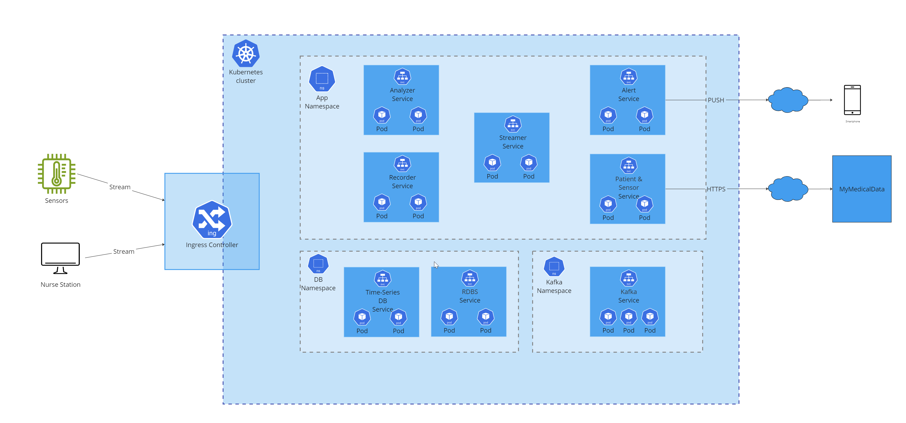
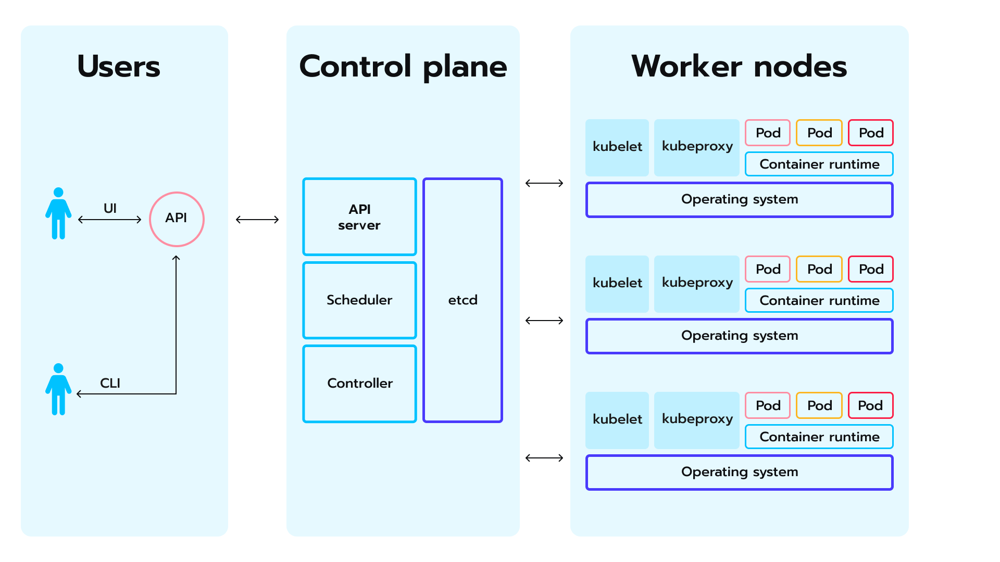

# Deployment diagram

## App on Kubernetes
The picture below shows the proposed deployment diagram.

In general, considering the critical importance of system availability and performance within our architecture, we have made the strategic decision to deploy Kubernetes on our on-premises infrastructure. Kubernetes offers a solution that aligns with our objectives of maintaining high availability and optimizing performance. 
One of the main benefits of Kubernetes is its advanced auto-scaling capabilities, which enable the system to dynamically adjust resource allocation based on demand fluctuations. This ensures that our application can efficiently handle varying workloads while minimizing resource wastage. 
Additionally, Kubernetes provides built-in mechanisms for achieving high availability, such as automated failover and load balancing, which help to mitigate the risk of downtime and ensure uninterrupted service delivery to our users. 
Overall, by leveraging Kubernetes, we can effectively manage and scale our infrastructure to meet the demands of our growing application while maintaining the highest standards of reliability and performance.

Detailed description:
* Sensors and Nurse station initiates connections to the K8s Ingress controller
* Each Service has defined proper auto-scaling policies (they are treated as an implementation details and doesn't important from architecture perspective)
* At least 2 Pods should be available all the time to keep system availability

**Important note!** The Kafka and databases are currently depicted as part of the Kubernetes deployment; however, it is possible to modify this configuration in subsequent steps to exclude them and instead install them directly on the Virtual Machines. 

## Kubernetes on-premise infrastructure

The diagram below illustrates the Kubernetes details installed on three separate operating systems (three virtual machines).

Our recommendation is to organize the hardware with three (or at least two) independent servers to safeguard against hardware failures.

**Important note!** the IT Administrator and Monitoring role is not a part of this architectural proposal, but it should be implemented when system is ready.

