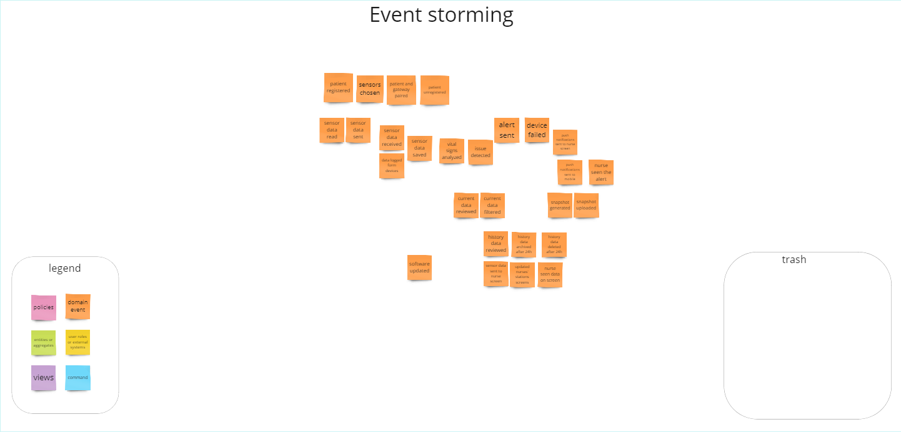
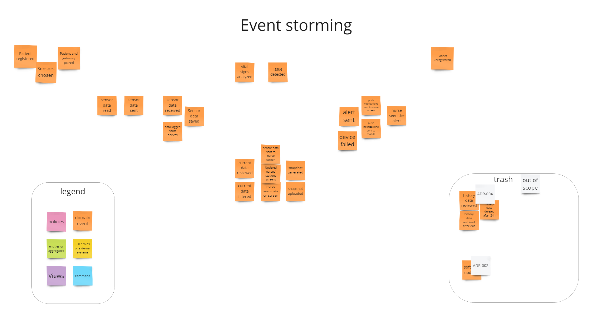
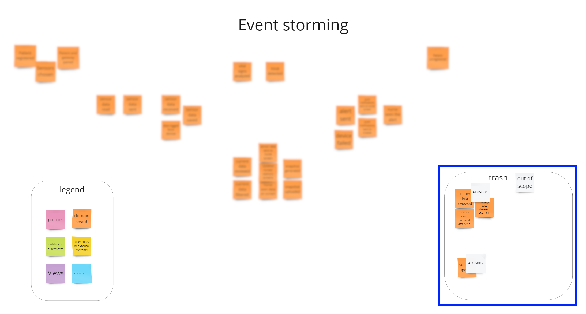
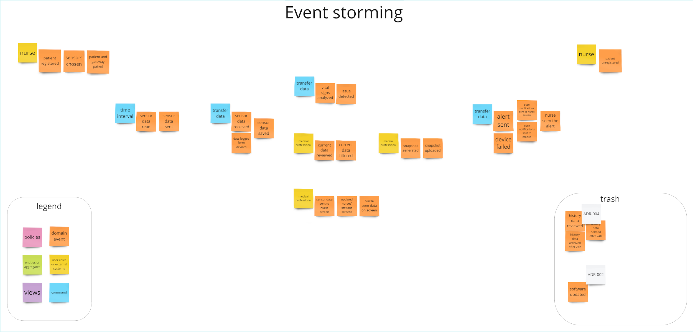
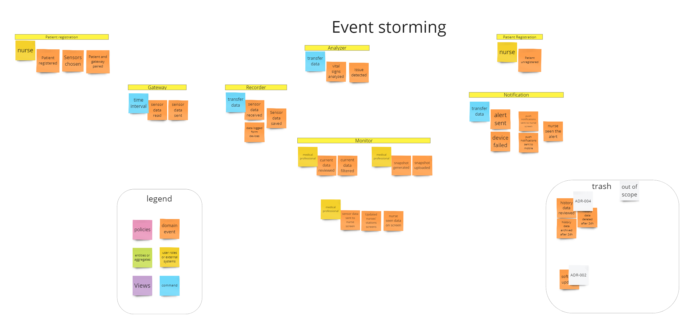
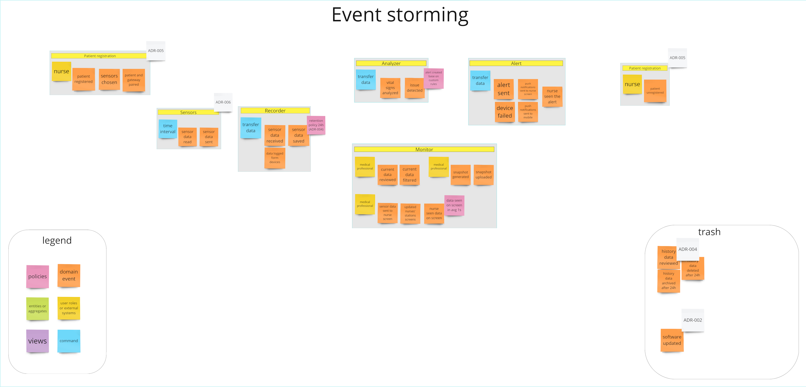
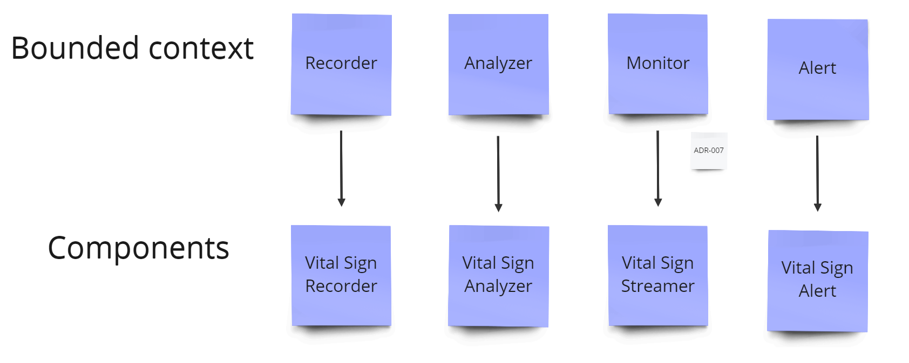

# Event storming
In the world of software engineering, the project "Monitor Me" presented a challenge to create an advanced system for monitoring patients' health status. This task required meticulous planning and the application of event-storming methodology to understand and design a system that reflects real needs and processes. Below, we detail the technical journey of the "Monitor Me" project, described through the phases of event storming, focusing on technical aspects and challenges.

## 1. Collecting events
The first step was to collect events crucial for the functioning of the "Monitor Me" system. The following events were identified:

- **Patient registered**: A new patient is added to the system, initiating their health monitoring journey.
- **Sensors chosen**: Specific sensors are selected based on the patient's health monitoring.
- **Patient and gateway paired**: The patient's device is paired with a gateway to facilitate the transmission of sensor data.
- **Sensor data read**: Sensors attached to the patient collect health data.
- **Sensor data sent**: The collected sensor data is sent from the patient's device to the system for processing.
- **Sensor data received**: The system receives sensor data transmitted from the patient's device.
- **Data logged from devices**: Sensor data is logged and stored in the system's database for future reference and analysis.
- **Sensor data saved**: The sensor data is saved in a structured format in the system's database.
- **Vital signs analyzed**: The system analyzes the received sensor data to assess the patient's vital signs.
- **Issue detected**: The system identifies an issue or anomaly in the patient's vital signs or sensor data.
- **Alert sent**: An alert is generated and sent to the medical staff if an issue is detected in the patient's health data.
- **Snapshot generated**: A snapshot of the current sensor data and patient status is created for quick review.
- **Snapshot uploaded**: The generated snapshot is uploaded to the system for access by the medical staff.
- **Patient unregistered**: A patient is removed from the system, ending their health monitoring session.
- **Device failed**: A failure is detected in one of the sensors or the patient's device.
- **Push notifications sent to nurse screen**: Push notifications are sent to the nurse's station or device to alert them of new data or issues.
- **Push notifications sent to mobile**: Push notifications are sent to mobile devices, alerting staff or patients about important updates or issues.
- **Nurse seen the alert**: Indicates that a nurse has viewed the alert generated by the system.
- **History data reviewed**: Medical staff reviews the historical data of a patient's health records.
- **History data archived after 24h**: Data that is older than 24 hours is archived for long-term storage.
- **History data deleted after 24h**: Data that is deemed unnecessary or non-critical is deleted after 24 hours to maintain data efficiency and privacy.
- **Software updated**: The system's software is updated to introduce new features, fix bugs, or improve performance.

## 2. Time sequencing
Subsequently, the events were sequenced chronologically to understand the flow of data and interactions within the system. This sequence helped identify the temporal dependencies between events and how they impact the system's operation and the patient care process.

## 3. Backward validation and removal of unnecessary events
In this phase, after a thorough analysis and validation of events, it was decided to remove unnecessary events that did not add value to the system or were redundant.
During this phase, we will not consider the "System Updated" event which has been deleted. However, it has to be agreed upon later. Link to [ADR-002](ADR/ADR-002-update-move-to-next-phase.md)

Events such as "history data reviewed", "history data archived after 24h", and "history data deleted after 24h" were eliminated, as they did not fit. Based on requirements, the solution will be addressed by storing data in a time-series database. Info Was added in [ADR-004](ADR/ADR-004-data-retention-policy.md)

## 4. Adding actors and commands
This phase defined the actors and commands necessary for user interaction with the system and event processing. Example commands include:

**user role**:
- nurse - frontline healthcare providers responsible for the setup of patient monitoring devices, ongoing monitoring, and responding to system-generated alerts and notifications.
- medical professionals - healthcare providers, including doctors and specialists, use the system for detailed analysis of patient health data and create snapshot data.

**commands**:
- time interval - sets or adjusts the intervals at which sensor data is read or updates are sent to healthcare providers, customizable to patient needs and condition severity.
- transfer data - initiates the transfer of patient data from sensors to the central system for analysis, or between healthcare systems, for comprehensive patient care management.

## 5. Grouping events
Events were grouped according to functionality or business processes, e.g., patient registration, data monitoring, and health status analysis. This grouping helped us understand the system's modular nature and facilitated the design of bounded context.

In this phase, bounded contexts:
1. Patient Registration
- manages the enrollment of new patients into the system.
- collects initial health data and sets up patient profiles.

2. Gateway
- serves as the bridge for data transmission between patient sensors/devices and the system's server.
- ensures secure and efficient data flow.

3. Recorder
- logs and stores incoming raw sensor data from patients.
- maintains data integrity and ensures it is readily accessible for analysis.

4. Analyzer
- processes and analyzes recorded data to detect health trends and anomalies.
- provides insights into patient health status.

5. Monitor
- continuously oversees patient data to ensure it remains within safe health parameters.
- identifies critical conditions that require immediate attention.

6. Alert
- generates and sends alerts and notifications to nurse monitors or mobile devices based on analysis results.
- ensures timely intervention by medical staff in response to patient health changes.

## 6. Adding policy
The final step was adding a policy for event and data management, which outlined how the system should respond to different scenarios. This policy included data retention rules, procedures for detecting anomalies in patient data, and communication protocols for critical situations.
- retention policy 24h - [ADR-004](/ADR/ADR-004-data-retention-policy.md) 
- alert created based on custom rules - based on requirements 
- data are seen on screen in average 1s - based on requirements

Detailed info:

# Summary:

During the design of the "Monitor Me" system, we created an ADR (Architectural Decision Record), documenting key architectural decisions made in the project. An ADR is not only a way to record the rationale behind decisions but also a tool to support future maintenance and development of the system.

By applying the Event Storming methodology, we can effectively define appropriate bounded contexts within our software architecture. Patient Registration, Sensors, Recorder, Analyzer, Monitor, and Alert represent distinct bounded contexts, each responsible for a specific business aspect of the system. This approach allows us to delineate and address the unique concerns associated with each context, facilitating a more organized and modular system design.

Available Bounded Contexts:

- **Patient Registration:** - manages the business process of registering patients and assigning them to the appropriate sensors.

- **Sensors:** - handles the responsibility of collecting vital signs and life activity data from patients.
 
- **Recorder:** - ensures the reception and secure storage of sensor data, preventing any loss or misplacement.
 
- **Monitor:** - displays monitored data for medical personnel, providing real-time insights into patient status.
 
- **Analyzer:** - responsible for analyzing data and detecting anomalies based on predefined rules.
 
- **Alert:** - manages the sending and delivery of notifications to the relevant systems based on identified issues.

Based on the requirements and responses from the email, the following steps have been taken:
1. **Patient Registration:** - is part of Monitor Me, but based on the client's response, we consider it as a supporting sub-domain. It will be a part of the system, but we won't be focusing on it." [ADR-005](/ADR/ADR-005-patient-registration-out-of-scope.md).
2. **Sensors:** - Also identified as a system component to be designed outside the scope of this solution, as outlined in [ADR-006](/ADR/ADR-006-sensor-out-of-scope.md).

Within the scope of this solution, the following contexts have been established: Recorder, Analyzer, Monitor, and Alert.

Transitioning from business contexts to component naming, it was realized that the term "Monitor" wasn't a suitable technical name for the responsibilities of this component. After careful consideration, we decided on a more fitting name: "Streamer." This decision was formalized in [ADR-007](/ADR/ADR-007-component-naming.md) , determining it as a more accurate name. To provide a clearer understanding of each component's business significance, the prefix "Vital Sign" was added. Consequently, the final set of components comprises:
 - Vital Sign Recorder,
 - Vital Sign Analyzer,
 - Vital Sign Streamer,
 - Vital Sign Alert. 

