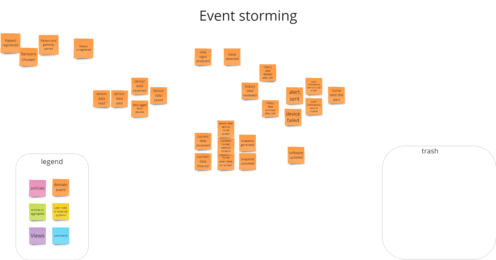

# Event storming
In the world of software engineering, the project "Monitor Me" presented a challenge to create an advanced system for monitoring patients' health status. This task required meticulous planning and the application of event-storming methodology to understand and design a system that reflects real needs and processes. Below, we detail the technical journey of the "Monitor Me" project, described through the phases of event storming, focusing on technical aspects and challenges.

## 1. Collecting Events
The first step was to collect events crucial for the functioning of the "Monitor Me" system. The following events were identified:

Patient registered
Sensors chosen
Patient and gateway paired
Sensor data read
Sensor data sent/received
Data logged from devices
Sensor data saved
Vital signs analyzed
Issue detected
Alert sent
Snapshot generated/uploaded
Patient unregistered

## 2. Time Sequencing
Subsequently, the events were sequenced chronologically to understand the flow of data and interactions within the system. This sequence helped identify the temporal dependencies between events and how they impact the system's operation and the patient care process.

## 3. Backward Validation and Removal of Unnecessary Events
In this phase, after a thorough analysis and validation of events, it was decided to remove unnecessary events that did not add value to the system or were redundant. Events such as "history data reviewed", "history data archived after 24h", and "history data deleted after 24h" were eliminated, as they did not fit the current data management policy and were incompatible with privacy requirements.

## 4. Adding Views and Commands
This phase defined the views and commands necessary for user interaction with the system and event processing. Example commands include:

RegisterPatient
ChooseSensors
PairPatientGateway
ReadSensorData
AnalyzeVitalSigns
GenerateSnapshot
Views were designed to present data to system users, such as:

Nurse dashboard
Patient status screen
Alert history

## 5. Grouping Events
Events were grouped according to functionality or business processes, e.g., patient registration, data monitoring, health status analysis. This grouping helped understand the system's modular nature and facilitated the design of microservices components.

## 6. Adding Policy
The final step was adding a policy for event and data management, which outlined how the system should respond to different scenarios. This policy included data security rules, procedures for detecting anomalies in patient data, and communication protocols for critical situations.

During the design of the "Monitor Me" system, the development team created an ADR (Architectural Decision Record), documenting key architectural decisions made in the project. An ADR is not only a way to record the rationale behind decisions but also a tool to support future maintenance and development of the system.

# Summary
By applying the event storming methodology, the "Monitor Me" project was successfully designed, considering all critical events, their dependencies, and defining key system components. This technical journey demonstrates how complex systems can be methodically designed, from identifying events to implementing management policies, ensuring their effectiveness and resilience to change.
