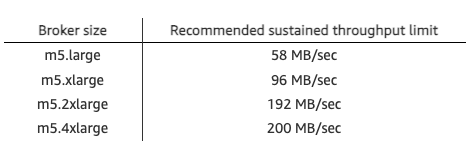

## Infrastructure sizing
### Throughput calculation

Average throughput per second per patient:

| Sensor           | Signals per second   |
|------------------|----------------------|
| Heart rate       | 2                    |
| Blood pressure   | 0,000277777777777778 |
| Oxygen level     | 0,2                  |
| Blood sugar      | 0,00833333333333333  |
| Respiration      | 1                    |
| ECG              | 1                    |
| Body temperature | 0,00333333333333333  |
| Sleep status     | 0,00833333333333333  |
| **Total**        | **4,22027777777778** |

If we assume, that maximum patients number is 500 and the single signal can utilize 1kB, than:

| Throughput type | Value     | Total (req/s) | Throughput (MB/s) |
|-----------------|-----------|---------------|-------------------|
| AVERAGE         | 4,2 * 500 | 2100          | 2,1 MB/s          |
| PEAK            | 8 * 500   | 4000          | 4 MB/s            |

This values shows us, that system MUST be ready to process 4000 signals in one second and network must be prepared to transfer at least 4MB/s.

### Estimated database write time utilization.
Based on [following benchmark](https://medium.com/machbase/performance-testing-and-comparison-of-time-series-databases-influxdb-and-machbase-c35b2fa8d91a)
we can assume that:
* Influx DB can save at least 237871 events/s
* In our case, we need to store 4000 events/s, so the storing process shouldn't be longer than **16ms**

### Publishing to Kafka
Based on [AWS benchmark](https://aws.amazon.com/blogs/big-data/best-practices-for-right-sizing-your-apache-kafka-clusters-to-optimize-performance-and-cost/)

 

considering the machine 16GB RAM, 4CPU and fast SSD disk (equivalent of m5.xlarge) the Kafka needs **4ms** to publish 4MB of data in second.

### LAN throughput
If we assume that the hospital has a 1Gb/s LAN, transmitting 4MB of data should take approximately **32 ms**.

### Streamer
If we assume that we have 3 Recorder services:
* Each instance must handle approximately 8.33 connections.
* Let's assume that each connection handles requests on separate threads (without considering processor context switching).
  * 1 connection should handle 20 patients, which means 160 signals per second.
  * If we assume that processing 1 signal takes 2 milliseconds, then the time needed to process signals on 1 connection is *320ms*.

### Recorded
To simplify calculations, we can assume that the amount of data is exactly the same as the Streamer process.
Then, we can simply state that the Streamer service also requires *320ms*.

### Final calculation (from sensor to nurse station)

| Step          | Total Time |
|---------------|------------|
| Recorder      | 320ms      |
| Streamer      | 320ms      |
| Save to DB    | 16 ms      |
| Send to Kafka | 5ms        |
| LAN           | 32ms       |
| **Total**     | **693ms**  |

