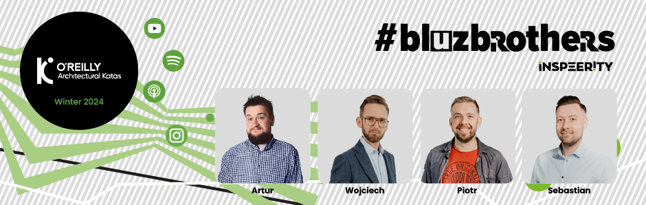
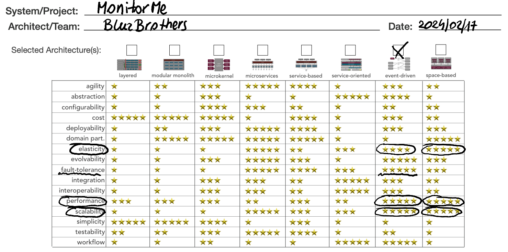
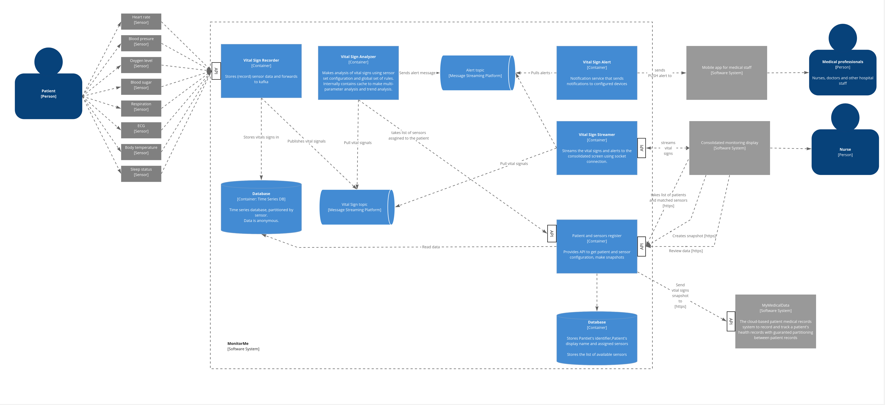

# StayHealthy.MonitorMe | Architectural Kata (Winter 2024)

## The BluzBrothers Team

* Artur Kruszewski &nbsp;[ LinkedIn](https://www.linkedin.com/in/artur-kruszewski/)
* Wojciech Kasa &nbsp;[ LinkedIn](https://www.linkedin.com/in/wojciech-kasa-b271b0141/)
* Piotr Filipowicz &nbsp;[ LinkedIn](https://www.linkedin.com/in/piotr-filipowicz-402b062a/)
* Sebastian Dąbkowski &nbsp;[ LinkedIn](https://www.linkedin.com/in/sebastiandabkowski/)

## Introduction
Welcome to the architectural story of MonitorMe - the O'Reilly Winter 2024 Architectural Kata.

MonitorMe is an advanced medical patient monitoring system created by StayHealthy, Inc. As the healthcare industry continues to evolve, the demand for sophisticated monitoring solutions becomes increasingly important. MonitorMe meets this demand by providing a comprehensive platform that continuously monitors patients' vital signs, analyzes data for potential issues, and notifies medical professionals when necessary. This architectural narrative offers a detailed exploration of MonitorMe's system architecture, emphasizing its main components, data flow, communication methods, and adherence to non-functional requirements. By understanding MonitorMe's architecture, stakeholders and the development team can gain insight into how the system functions, its alignment with business objectives, and its potential to improve patient care in healthcare environments. Let's explore the architectural complexities of MonitorMe to reveal its innovative design and capabilities. 

## *MonitorMe* Overview
StayHealthy, Inc. is a large and highly successful medical software company located in San Francisco, California, US. They currently have 2 popular cloud-based SAAS products: MonitorThem and MyMedicalData.
MonitorThem a comprehensive data analytics platform that is used for hospital trend and performance analytics-alert response times, patient health problem analytics, patient recovery analysis, and so on.
MyMedicalData is a comprehensive cloud-based patient medical records system used by doctors, nurses, and other health professionals to record and track a patient's health records with guaranteed partitioning between patient records.
StayHealthy, Inc. is now expanding into the medical monitoring market and is in need of a new medical patient monitoring system for hospitals that monitors a patient's vital signs using proprietary medical monitoring devices built by StayHealthy, Inc.

## The requirements
Upon receiving the [requirements](requirements.md) from the stakeholders, our team proceeded to analyze and distill the information provided. This involved a thorough examination and refinement process to extract the essential elements and key details. 
By conducting this requirements distillation, we aimed to ensure a clear understanding of the project scope and objectives, enabling us to proceed with the development process effectively and efficiently. 
We came up with [distilled requirements](Business/distilled-requirements.md). Frankly speaking, all these requirements can be covered by the three main data flows:
* Collecting data from sensors and visualizing them on the nurse's station.
* Alerting the medical staff on both mobile devices and the nurse's station when anomalies are detected based on defined and easily extendable rules.
* Browsing the patient's vital signs (maximum 24 hours) and sending the snapshot to *MyMedicalData.*

## Exploring the business domain (find better name for business domain)
We conducted *Event Storming* technique to identify business domain for the MonitorMe system. 
This collaborative workshop helped us visualize system workflows, identify domain events, and determine the interactions between components. 
Through this process, we identified the necessary components and their relationships, informing the design and implementation of the system.
Here are the results:

## Architecture characteristics identification
The Business Requirements and Event Storming results have led us to delve deeper into the project and [identify crucial architectural characteristics](ArchitectureCharacteristics/characteristics.md) that are highly important for the Monitor Me system.

Choosing the right architectural characteristics is a critical process that lays the foundation for designing an effective architecture and defining efficient data flow within a system. By carefully considering these characteristics, one can determine the most suitable software and hardware components to effectively fulfill the system requirements. This ensures not only the proper functioning of the system but also its scalability, maintainability, and overall performance.
Based on the requirements and our expertise, the following top three characteristics have been identified:

## Choosing the architecture
Having identified the top three driving characteristics, we can simply choose the architecture style that best fits our business case.

## The architecture details
By utilizing the C4 approach, specifically focusing on the Context (C1) and Container (C2) views, we can effectively visualize the overall structure and key dependencies within the MonitorMe system. 

### Context view (C1)
The Context view allows us to understand the high-level relationships and interactions between the system and its external components or systems. 

The whole description of the Context view can be found [here](/C4/C1-context.md).

### Component view (C2)
Meanwhile, the Container view provides a detailed breakdown of the internal components and how they are organized within containers such as services, databases, and user interfaces. 
This approach enables us to gain a comprehensive understanding of the system architecture, facilitating effective communication and decision-making throughout the development process.

The picture below show the final Container (C2) view.

The whole description of the Context view can be found [here](/C4/C2-containers.md).

## Supportive domains

 | Functionality                          | Description                                                                                                                                                                                                                                                                                                     |
 |----------------------------------------|-----------------------------------------------------------------------------------------------------------------------------------------------------------------------------------------------------------------------------------------------------------------------------------------------------------------|
 | Authentication and Authorization       | The whole authentication and authorization should be considered, hovwer it is a known issue that could be solved on both ways:  - as a part of MonitorMe system  - as the SSO of the current solution in hospital                                                                                      |
 | Push notifications to the mobole phone | Push notifications are a standard solution for delivering real-time alerts to users' devices. However, their implementation falls outside the scope of the current architecture proposal, which focuses on defining system components. Integrating push notification functionality will be addressed separately. |
 | VPN to the external systems            | To decide in further steps whether establishing VPN for access to the MedicalData is worth considering for enhanced security and privacy. On this stage, it doesn't play significant role and this decision can be taken later.                                                                                 |