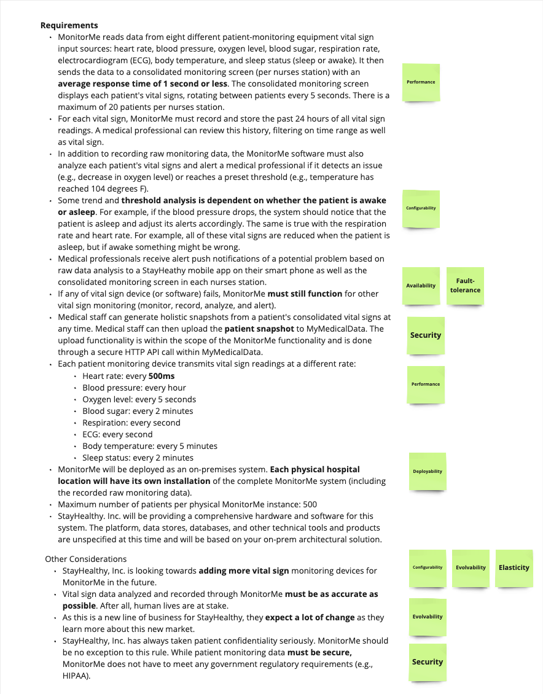
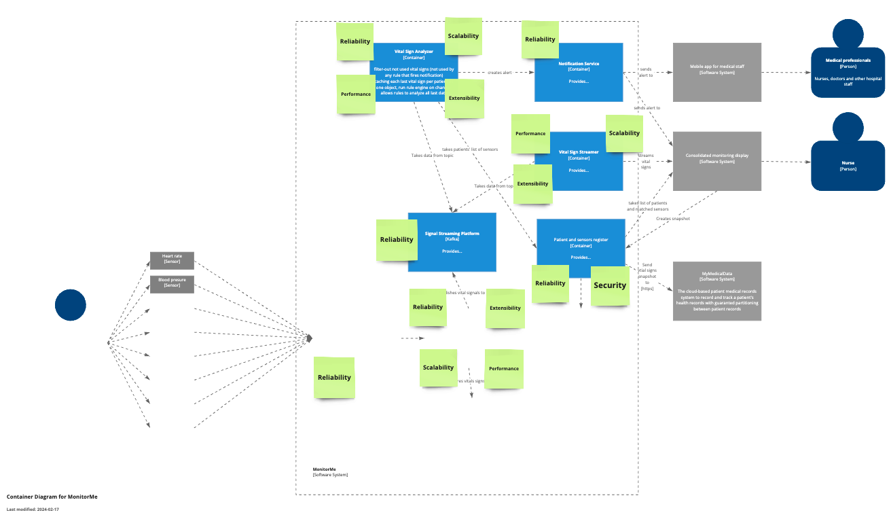
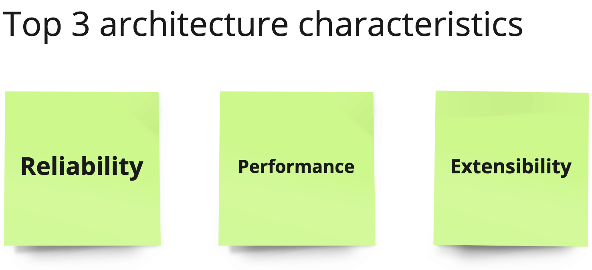

# Architecture characteristics

## Requirements Distillation
To effectively select the appropriate architecture characteristics, it is essential to begin with the requirements and meticulously identify keywords, aligning them with the pertinent definitions of architecture characteristics.

# Top 7 architecture characteristics

Architecture characteristics define key qualities of a software system that are crucial for meeting business objectives, technical requirements, and user expectations. Below are definitions for the specified architectural characteristics

| Term          | Definition                                                                                                                                                  |
|---------------|-------------------------------------------------------------------------------------------------------------------------------------------------------------|
| Scalability   | Scalability refers to a system's ability to handle increased loads without compromising performance or user experience. This can involve scaling up (adding more resources to the existing infrastructure) or scaling out (adding more instances of resources). Scalability ensures that the system can grow in response to increased demand, whether it's handling more data, users, or transactions.|
| Reliability   | Reliability is the measure of a system's uptime and its ability to perform its required functions under stated conditions for a specified time. It encompasses the system's ability to recover from failures, maintain data integrity, and operate continuously without significant downtime or data loss. |
| Security      | Security encompasses the strategies, practices, and technologies designed to protect data and systems from unauthorized access, breaches, attacks, and other cyber threats. It involves ensuring data confidentiality, integrity, and availability, protecting against vulnerabilities, and complying with relevant regulations and standards.|
| Performance   | Performance refers to a system's responsiveness, speed, and stability under a given load. It measures how quickly a system can process transactions, execute tasks, and deliver information to users. High performance contributes to a better user experience and efficiency in operations. |
| Deployability | Deployability is the ease with which a software system can be deployed, updated, or migrated to different environments. It includes considerations for packaging, configuration, and installation processes. Systems with high deployability support rapid releases, easier updates, and minimal downtime. |
| Extensibility | Extensibility is the ability of a system to accommodate changes or add new functionalities without significant modifications to the existing codebase. It involves designing the system in a modular way, with well-defined interfaces and flexible components, so that it can evolve over time to meet changing business needs. |
| Continuity    |  Continuity, often referred to in the context of business continuity, is the system's ability to continue operating and providing essential functions, even in the face of disruptions, failures, or disasters. It involves planning for redundancy, failover mechanisms, data backups, and disaster recovery processes to ensure the system remains operational under adverse conditions.                                                                                               |

# Finding top3 architecture characteristics
The subsequent step involves tagging identified software and hardware components, placing sticky notes where the characteristic is necessary. 

# Top3 architecture characteristics

